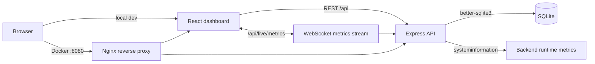
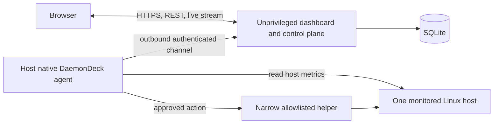

# DaemonDeck

Linux server monitoring and operations dashboard for tracking system health,
resource usage, running processes, audit activity, and role-gated actions from a
web UI.

DaemonDeck currently provides a working dashboard around the machine or container
where its backend process runs. The v1 target is a genuine single-host,
systemd-based Linux tool: an unprivileged dashboard/control plane paired with a
small host-native agent that collects the monitored host's data and performs only
approved operations.

## v1 Product Direction

DaemonDeck v1 targets developers, homelab operators, and small-team DevOps/SRE
operators responsible for one systemd-based Linux server. The monitored host will
run a host-native TypeScript agent; the React frontend and Express control plane
may remain containerized without privileged mode, the host PID namespace, broad
host mounts, or the Docker socket.

The detailed scope, security boundaries, non-goals, and release acceptance criteria
are defined in [docs/v1-scope.md](docs/v1-scope.md).

## Current Implementation

- Monitors CPU, memory, disk, OS details, uptime, and processes visible to the
  backend runtime.
- Streams live CPU, memory, and disk metrics over WebSocket.
- Supports live pause/resume, manual refresh, last-updated timestamps, and 5s/10s/30s/1m refresh intervals.
- Shows CPU per-core usage, load average, top CPU processes, and trend charts.
- Shows total/used/free memory, swap usage, top memory processes, and trend charts.
- Shows mounted disk partitions with usage and health status.
- Lists real running processes with PID, name, CPU %, memory %, user, status, and start time.
- Supports process search, CPU/memory sorting, process detail views, manual
  refresh, and an opt-in permission-gated `SIGTERM` action within the backend's
  process namespace.
- Persists users, bcrypt-hashed passwords, alert rules, and audit logs in SQLite.
- Uses JWT sessions with role-based access control for viewer, operator, and admin users.

The current hard-coded managed restarts, alert toggles, and admin system-action
responses are prototypes. They do not yet control real host services, evaluate
alert conditions, send notifications, or execute the named system actions.

## Tech Stack

| Layer | Tech |
| --- | --- |
| Frontend | React, TypeScript, Vite, Recharts |
| Backend | Node.js, Express, TypeScript |
| Live updates | WebSocket |
| Current metrics | `systeminformation` in the backend runtime |
| v1 host collection | Host-native Node.js/TypeScript agent (planned) |
| Storage | SQLite with `better-sqlite3` |
| Auth | `jsonwebtoken`, bcrypt password hashing |
| Request hardening | Helmet, login rate limiting, Zod validation |
| Deployment | Docker, Docker Compose, Nginx reverse proxy |

## Current Feature Status

`Implemented` means the behavior works end to end within the limitation stated in
the same row. `Prototype` means code or UI exists but is simulated, incomplete, or
not reliable enough for the v1 promise. `Planned` means there is no complete
end-to-end implementation yet.

| Area | Status | Current limitation or outcome |
| --- | --- | --- |
| Login, logout, and protected routes | Implemented | JWT revocation is held in backend memory |
| Viewer/operator/admin authorization | Implemented | Enforced by the API; production hardening remains |
| SQLite users and bcrypt password hashes | Implemented | Fixed demo users are seeded on an empty database |
| Server overview UI | Implemented | Describes the backend runtime, not an enrolled host |
| CPU, memory, and disk metrics | Implemented | Collected from the backend machine/container |
| Process list, search, sorting, and details | Implemented | Limited to processes visible to the backend runtime |
| WebSocket live metrics and refresh controls | Implemented | A connected stream is not revalidated after upgrade |
| Metric trend chart | Implemented | Keeps only the current browser session's recent samples |
| Loading, error, empty, and last-updated states | Implemented | Does not yet model agent stale/offline states |
| Audit-log persistence | Implemented | Stores the latest 100 entries shown by the API |
| Docker Compose, Nginx, data volume, and health checks | Implemented | Deploys the dashboard; it does not grant host observability |
| Opt-in process termination | Prototype | Sends `SIGTERM` inside the backend process namespace |
| Managed service restarts | Prototype | Updates three hard-coded in-memory records only |
| Alert-rule administration | Prototype | Persists enable/disable toggles but does not evaluate rules |
| Admin system actions | Prototype | Validates and logs a request but performs no action |
| Host-native single-host agent | Planned | Required source of truth for genuine v1 host data |
| Agent enrollment, identity, heartbeat, and stale/offline state | Planned | Required by the v1 acceptance criteria |
| Allowlisted real service management | Planned | Will be agent-mediated and audited |
| Structured alert evaluation and webhook notification | Planned | Required for v1 alerts |
| Persisted metric history | Planned | Current trends are browser-memory only |
| Docker workload monitoring | Planned | Explicitly outside v1 |
| Multi-server management | Planned | Explicitly outside v1 |

## Roles

| Role | Permissions |
| --- | --- |
| Viewer | View dashboard, metrics, logs, and process data |
| Operator | Viewer permissions plus current prototype process and managed-restart actions |
| Admin | Operator permissions plus users, roles, alert toggles, and prototype system actions |

Demo accounts:

```txt
demo / password123
viewer / password123
operator / password123
```

The demo passwords are stored as bcrypt hashes in SQLite after the first backend start.

## Demo Walkthrough

1. Sign in with `demo / password123` for admin access.
2. Open **Overview** to inspect the backend runtime's health, CPU, memory, disk,
   uptime, OS, kernel, process count, and threshold-derived health counts.
3. Open **Metrics** to watch live CPU, memory, and disk charts. Change the refresh interval between `5s`, `10s`, `30s`, and `1m`, or pause live updates.
4. Open **Processes** to search visible processes, sort by CPU or memory usage,
   view process details, and inspect the operator/admin prototype actions.
5. Open **Logs** to review persisted audit activity.
6. Open **Admin** as the demo admin user to manage roles and inspect the prototype
   alert and system-action controls.

## Screenshots

| Screen | Screenshot |
| --- | --- |
| Login | [docs/screenshots/login.png](docs/screenshots/login.png) |
| Overview | [docs/screenshots/overview.png](docs/screenshots/overview.png) |
| Metrics | [docs/screenshots/metrics.png](docs/screenshots/metrics.png) |
| Processes | [docs/screenshots/processes.png](docs/screenshots/processes.png) |
| Admin | [docs/screenshots/admin.png](docs/screenshots/admin.png) |

## Architecture

### Current Architecture



When the backend runs directly on a machine, the runtime is that machine. When the
backend runs through the supplied Docker Compose deployment, the runtime is
normally the backend container. The current Compose configuration therefore
deploys the dashboard but is not yet a host-monitoring deployment.

### Target v1 Architecture



The agent, protocol, and helper are planned work. See
[the v1 product definition](docs/v1-scope.md) before implementing or deploying
host operations.

## Getting Started

### 1. Backend

```bash
cd backend
npm install
npm run dev
```

The API runs on:

```txt
http://localhost:5000
```

### 2. Frontend

```bash
cd frontend
npm install
npm run dev
```

The app runs on:

```txt
http://localhost:5173
```

## Docker Deployment

DaemonDeck can also run as a two-container Docker Compose deployment:

- `frontend` - builds the React app and serves it through Nginx.
- `backend` - runs the Express API and writes SQLite data to a persistent volume.
- `daemondeck-data` - Docker volume mounted at `/app/data` for the SQLite database.

> **Current monitoring boundary:** this deployment monitors the backend container's
> runtime. It does not yet monitor or control the Docker host. The v1 design adds a
> separate host-native agent instead of privileging these containers.

Start the stack:

```bash
docker compose up --build
```

Open the app:

```txt
http://localhost:8080
```

Stop the stack:

```bash
docker compose down
```

Stop the stack and remove the persisted SQLite volume:

```bash
docker compose down -v
```

Set a stronger token secret before running outside local development:

```bash
AUTH_TOKEN_SECRET=replace-with-a-long-random-secret docker compose up --build
```

PowerShell:

```powershell
$env:AUTH_TOKEN_SECRET="replace-with-a-long-random-secret"
docker compose up --build
```

Healthchecks:

```bash
docker compose ps
docker compose exec backend node -e "fetch('http://127.0.0.1:5000/api/health').then(r => console.log(r.status))"
docker compose exec frontend wget -qO- http://127.0.0.1/health
```

Nginx serves the frontend and proxies:

```txt
/api/*                  -> backend:5000
/api/live/metrics       -> backend:5000 WebSocket stream
```

## Environment

Optional local environment files:

```bash
cp backend/.env.example backend/.env
cp frontend/.env.example frontend/.env
```

PowerShell:

```powershell
Copy-Item backend/.env.example backend/.env
Copy-Item frontend/.env.example frontend/.env
```

Backend options:

```txt
PORT=5000
CLIENT_URL=http://localhost:5173
SESSION_TTL_MINUTES=60
AUTH_TOKEN_SECRET=replace-with-a-long-random-local-secret
DATABASE_PATH=./data/daemondeck.sqlite
ENABLE_PROCESS_KILL=false
TRUST_PROXY=false
```

By default, the backend creates a local SQLite database at:

```txt
backend/data/daemondeck.sqlite
```

Local database files are ignored by Git.

## Health Thresholds

Thresholds are centralized in `backend/src/config/thresholds.ts`.

```txt
CPU     > 80% warning, > 90% critical
Memory  > 85% warning, > 95% critical
Disk    > 80% warning, > 90% critical
```

The dashboard classifies health as:

| Status | Meaning |
| --- | --- |
| Healthy | CPU, memory, and disk are below warning thresholds |
| Warning | At least one metric crossed its warning threshold |
| Critical | At least one metric crossed its critical threshold |

## Security Notes

- Demo credentials are for local development only.
- Set a strong `AUTH_TOKEN_SECRET` before using the app outside local development.
- JWTs are signed and verified with `jsonwebtoken`.
- Login attempts are rate limited and request bodies are validated with Zod.
- Process kill actions are permission-gated, require UI confirmation, and stay
  disabled unless `ENABLE_PROCESS_KILL=true`. They act only in the backend's
  visible process namespace; they are not a Docker-host control mechanism.
- Audit logs include action names, success/failure/blocked status, and request IP address when available.

## Development Checks

Test backend:

```bash
cd backend
npm test
```

Build backend:

```bash
cd backend
npm run build
```

Build frontend:

```bash
cd frontend
npm run build
```
