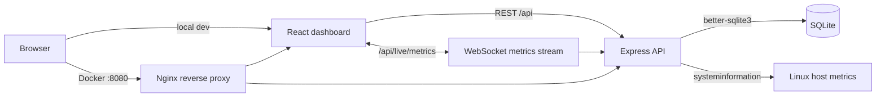

# DaemonDeck

Real-time Linux server monitoring dashboard for tracking system health, resource usage, running processes, audit activity, and role-gated operational actions from a web UI.

DaemonDeck is built as a practical DevOps/SRE dashboard: a React frontend, an Express API, live WebSocket metrics, SQLite persistence, JWT authentication, and real host metrics collected with `systeminformation`.

## What It Does

- Monitors CPU, memory, disk, OS details, uptime, and running process count.
- Streams live CPU, memory, and disk metrics over WebSocket.
- Supports live pause/resume, manual refresh, last-updated timestamps, and 5s/10s/30s/1m refresh intervals.
- Shows CPU per-core usage, load average, top CPU processes, and trend charts.
- Shows total/used/free memory, swap usage, top memory processes, and trend charts.
- Shows mounted disk partitions with usage and health status.
- Lists real running processes with PID, name, CPU %, memory %, user, status, and start time.
- Supports process search, CPU/memory sorting, process detail views, manual refresh, and permission-gated kill actions.
- Persists users, bcrypt-hashed passwords, alert rules, and audit logs in SQLite.
- Uses JWT sessions with role-based access control for viewer, operator, and admin users.

## Tech Stack

| Layer | Tech |
| --- | --- |
| Frontend | React, TypeScript, Vite, Recharts |
| Backend | Node.js, Express, TypeScript |
| Live updates | WebSocket |
| Metrics | `systeminformation` |
| Storage | SQLite with `better-sqlite3` |
| Auth | `jsonwebtoken`, bcrypt password hashing |
| Request hardening | Helmet, login rate limiting, Zod validation |
| Deployment | Docker, Docker Compose, Nginx reverse proxy |

## Current Feature Status

| Area | Status |
| --- | --- |
| Login, logout, protected routes | Done |
| Role-based access control | Done |
| SQLite users and hashed passwords | Done |
| Server overview cards | Done |
| CPU monitoring | Done |
| Memory monitoring | Done |
| Disk monitoring | Done |
| Process monitoring | Done |
| WebSocket live metrics | Done |
| Configurable refresh intervals | Done |
| Last updated timestamps | Done |
| Loading, error, and empty states | Done |
| Process details modal | Done |
| Metric trend charts | Done |
| Docker Compose deployment | Done |
| Nginx reverse proxy | Done |
| Persistent SQLite Docker volume | Done |
| Container healthchecks | Done |
| Audit logs | Persistent logs with action, status, and IP address |
| Alert rules | Basic persistent rules |
| Service monitoring | Not yet |
| Docker monitoring | Not yet |
| Multi-server agent architecture | Not yet |

## Roles

| Role | Permissions |
| --- | --- |
| Viewer | View dashboard, metrics, logs, and process data |
| Operator | Viewer permissions plus process and managed restart actions |
| Admin | Operator permissions plus user roles, alert rules, and system actions |

Demo accounts:

```txt
demo / password123
viewer / password123
operator / password123
```

The demo passwords are stored as bcrypt hashes in SQLite after the first backend start.

## Demo Walkthrough

1. Sign in with `demo / password123` for admin access.
2. Open **Overview** to inspect host health, CPU, memory, disk, uptime, OS, kernel, process count, and alert counts.
3. Open **Metrics** to watch live CPU, memory, and disk charts. Change the refresh interval between `5s`, `10s`, `30s`, and `1m`, or pause live updates.
4. Open **Processes** to search running processes, sort by CPU or memory usage, view process details, and use operator/admin-only process actions.
5. Open **Logs** to review persisted audit activity.
6. Open **Admin** as the demo admin user to manage roles, alert rules, and system actions.

## Screenshots

| Screen | Screenshot |
| --- | --- |
| Login | [docs/screenshots/login.png](docs/screenshots/login.png) |
| Overview | [docs/screenshots/overview.png](docs/screenshots/overview.png) |
| Metrics | [docs/screenshots/metrics.png](docs/screenshots/metrics.png) |
| Processes | [docs/screenshots/processes.png](docs/screenshots/processes.png) |
| Admin | [docs/screenshots/admin.png](docs/screenshots/admin.png) |

## Architecture



## Getting Started

### 1. Backend

```bash
cd backend
npm install
npm run dev
```

The API runs on:

```txt
http://localhost:5000
```

### 2. Frontend

```bash
cd frontend
npm install
npm run dev
```

The app runs on:

```txt
http://localhost:5173
```

## Docker Deployment

DaemonDeck can also run as a two-container Docker Compose deployment:

- `frontend` - builds the React app and serves it through Nginx.
- `backend` - runs the Express API and writes SQLite data to a persistent volume.
- `daemondeck-data` - Docker volume mounted at `/app/data` for the SQLite database.

Start the stack:

```bash
docker compose up --build
```

Open the app:

```txt
http://localhost:8080
```

Stop the stack:

```bash
docker compose down
```

Stop the stack and remove the persisted SQLite volume:

```bash
docker compose down -v
```

Set a stronger token secret before running outside local development:

```bash
AUTH_TOKEN_SECRET=replace-with-a-long-random-secret docker compose up --build
```

PowerShell:

```powershell
$env:AUTH_TOKEN_SECRET="replace-with-a-long-random-secret"
docker compose up --build
```

Healthchecks:

```bash
docker compose ps
docker compose exec backend node -e "fetch('http://127.0.0.1:5000/api/health').then(r => console.log(r.status))"
docker compose exec frontend wget -qO- http://127.0.0.1/health
```

Nginx serves the frontend and proxies:

```txt
/api/*                  -> backend:5000
/api/live/metrics       -> backend:5000 WebSocket stream
```

## Environment

Optional local environment files:

```bash
cp backend/.env.example backend/.env
cp frontend/.env.example frontend/.env
```

PowerShell:

```powershell
Copy-Item backend/.env.example backend/.env
Copy-Item frontend/.env.example frontend/.env
```

Backend options:

```txt
PORT=5000
CLIENT_URL=http://localhost:5173
SESSION_TTL_MINUTES=60
AUTH_TOKEN_SECRET=replace-with-a-long-random-local-secret
DATABASE_PATH=./data/daemondeck.sqlite
ENABLE_PROCESS_KILL=false
TRUST_PROXY=false
```

By default, the backend creates a local SQLite database at:

```txt
backend/data/daemondeck.sqlite
```

Local database files are ignored by Git.

## Health Thresholds

Thresholds are centralized in `backend/src/config/thresholds.ts`.

```txt
CPU     > 80% warning, > 90% critical
Memory  > 85% warning, > 95% critical
Disk    > 80% warning, > 90% critical
```

The dashboard classifies health as:

| Status | Meaning |
| --- | --- |
| Healthy | CPU, memory, and disk are below warning thresholds |
| Warning | At least one metric crossed its warning threshold |
| Critical | At least one metric crossed its critical threshold |

## Security Notes

- Demo credentials are for local development only.
- Set a strong `AUTH_TOKEN_SECRET` before using the app outside local development.
- JWTs are signed and verified with `jsonwebtoken`.
- Login attempts are rate limited and request bodies are validated with Zod.
- Process kill actions are permission-gated, require UI confirmation, and stay disabled unless `ENABLE_PROCESS_KILL=true`.
- Audit logs include action names, success/failure/blocked status, and request IP address when available.

## Development Checks

Test backend:

```bash
cd backend
npm test
```

Build backend:

```bash
cd backend
npm run build
```

Build frontend:

```bash
cd frontend
npm run build
```
