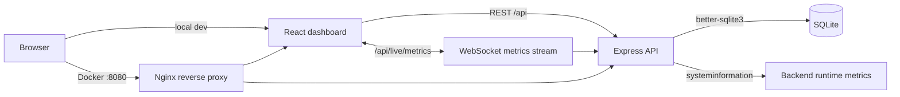
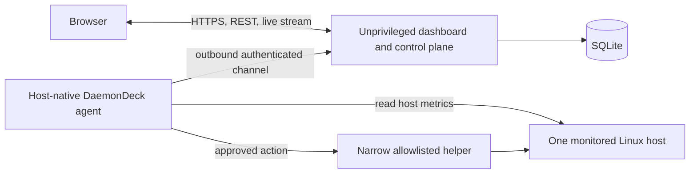

# DaemonDeck

Linux server monitoring and operations dashboard for tracking system health,
resource usage, running processes, audit activity, and role-gated actions from a
web UI.

DaemonDeck currently provides a working dashboard around the machine or container
where its backend process runs. The v1 target is a genuine single-host,
systemd-based Linux tool: an unprivileged dashboard/control plane paired with a
small host-native agent that collects the monitored host's data and performs only
approved operations.

## v1 Product Direction

DaemonDeck v1 targets developers, homelab operators, and small-team DevOps/SRE
operators responsible for one systemd-based Linux server. The monitored host will
run a host-native TypeScript agent; the React frontend and Express control plane
may remain containerized without privileged mode, the host PID namespace, broad
host mounts, or the Docker socket.

The detailed scope, security boundaries, non-goals, and release acceptance criteria
are defined in [docs/v1-scope.md](docs/v1-scope.md).

## Current Implementation

- Monitors CPU, memory, disk, OS details, uptime, and processes visible to the
  backend runtime.
- Streams live CPU, memory, and disk metrics over WebSocket.
- Supports live pause/resume, manual refresh, last-updated timestamps, and 5s/10s/30s/1m refresh intervals.
- Shows CPU per-core usage, load average, top CPU processes, and trend charts.
- Shows total/used/free memory, swap usage, top memory processes, and trend charts.
- Shows mounted disk partitions with usage and health status.
- Lists real running processes with PID, name, CPU %, memory %, user, status, and start time.
- Supports process search, CPU/memory sorting, process detail views, manual
  refresh, and an opt-in permission-gated `SIGTERM` action within the backend's
  process namespace.
- Persists users, bcrypt-hashed passwords, alert rules, and audit logs in SQLite.
- Uses JWT sessions with role-based access control for viewer, operator, and admin users.

The current hard-coded managed restarts, alert toggles, and admin system-action
responses are prototypes. They do not yet control real host services, evaluate
alert conditions, send notifications, or execute the named system actions.

## Tech Stack

| Layer | Tech |
| --- | --- |
| Frontend | React, TypeScript, Vite, Recharts |
| Backend | Node.js, Express, TypeScript |
| Live updates | WebSocket |
| Current metrics | `systeminformation` in the backend runtime |
| v1 host collection | Host-native Node.js/TypeScript agent (planned) |
| Storage | SQLite with `better-sqlite3` |
| Auth | `jsonwebtoken`, bcrypt password hashing |
| Request hardening | Helmet, login rate limiting, Zod validation |
| Deployment | Docker, Docker Compose, Nginx reverse proxy |

## Current Feature Status

`Implemented` means the behavior works end to end within the limitation stated in
the same row. `Prototype` means code or UI exists but is simulated, incomplete, or
not reliable enough for the v1 promise. `Planned` means there is no complete
end-to-end implementation yet.

| Area | Status | Current limitation or outcome |
| --- | --- | --- |
| Login, logout, and protected routes | Implemented | JWT revocation is held in backend memory |
| Viewer/operator/admin authorization | Implemented | Enforced by the API; token revocation remains in-memory until persistent sessions are added |
| SQLite users and bcrypt password hashes | Implemented | Demo users require explicit `NODE_ENV=development` or `test` plus `DEMO_MODE=true`; non-demo databases require a bootstrap admin |
| Server overview UI | Implemented | Describes the backend runtime, not an enrolled host |
| CPU, memory, and disk metrics | Implemented | Collected from the backend machine/container |
| Process list, search, sorting, and details | Implemented | Limited to processes visible to the backend runtime |
| WebSocket live metrics and refresh controls | Implemented | Revalidates sessions independently of the display interval and closes revoked sessions; token transport still needs a future URL-free design |
| Metric trend chart | Implemented | Keeps only the current browser session's recent samples |
| Loading, error, empty, and last-updated states | Implemented | Does not yet model agent stale/offline states |
| Audit-log persistence | Implemented | Stores the latest 100 entries shown by the API |
| Docker Compose, Nginx, data volume, and health checks | Implemented | Deploys the dashboard; it does not grant host observability |
| Secure startup, JSON API errors, and graceful shutdown | Implemented | Production requires explicit credentials; persistent session revocation is still planned |
| Opt-in process termination | Prototype | Sends `SIGTERM` inside the backend process namespace |
| Managed service restarts | Prototype | Updates three hard-coded in-memory records only |
| Alert-rule administration | Prototype | Persists enable/disable toggles but does not evaluate rules |
| Admin system actions | Prototype | Validates and logs a request but performs no action |
| Host-native single-host agent | Planned | Required source of truth for genuine v1 host data |
| Agent enrollment, identity, heartbeat, and stale/offline state | Planned | Required by the v1 acceptance criteria |
| Allowlisted real service management | Planned | Will be agent-mediated and audited |
| Structured alert evaluation and webhook notification | Planned | Required for v1 alerts |
| Persisted metric history | Planned | Current trends are browser-memory only |
| Docker workload monitoring | Planned | Explicitly outside v1 |
| Multi-server management | Planned | Explicitly outside v1 |

## Roles

| Role | Permissions |
| --- | --- |
| Viewer | View dashboard, metrics, logs, and process data |
| Operator | Viewer permissions plus current prototype process and managed-restart actions |
| Admin | Operator permissions plus users, roles, alert toggles, and prototype system actions |

## Local Demo Mode

Demo data is available only when both `NODE_ENV=development` (or `test`) and
`DEMO_MODE=true` are set before the first start of an empty database. An omitted,
misspelled, or deployment-specific `NODE_ENV` is treated as production-like and
cannot enable demo mode. It creates the following development-only accounts:

```txt
demo / password123
viewer / password123
operator / password123
```

The demo passwords are stored as bcrypt hashes in SQLite. Never enable demo mode
or use these credentials on a production deployment.

## Demo Walkthrough

1. Start a fresh local database with `DEMO_MODE=true`, then sign in with
   `demo / password123` for demo-only admin access.
2. Open **Overview** to inspect the backend runtime's health, CPU, memory, disk,
   uptime, OS, kernel, process count, and threshold-derived health counts.
3. Open **Metrics** to watch live CPU, memory, and disk charts. Change the refresh interval between `5s`, `10s`, `30s`, and `1m`, or pause live updates.
4. Open **Processes** to search visible processes, sort by CPU or memory usage,
   view process details, and inspect the operator/admin prototype actions.
5. Open **Logs** to review persisted audit activity.
6. Open **Admin** as the demo admin user to manage roles and inspect the prototype
   alert and system-action controls.

## Screenshots

| Screen | Screenshot |
| --- | --- |
| Login | Re-capture pending; the previous image showed retired demo-account wording. |
| Overview | [docs/screenshots/overview.png](docs/screenshots/overview.png) |
| Metrics | [docs/screenshots/metrics.png](docs/screenshots/metrics.png) |
| Processes | [docs/screenshots/processes.png](docs/screenshots/processes.png) |
| Admin | [docs/screenshots/admin.png](docs/screenshots/admin.png) |

## Architecture

### Current Architecture



When the backend runs directly on a machine, the runtime is that machine. When the
backend runs through the supplied Docker Compose deployment, the runtime is
normally the backend container. The current Compose configuration therefore
deploys the dashboard but is not yet a host-monitoring deployment.

### Target v1 Architecture



The agent, protocol, and helper are planned work. See
[the v1 product definition](docs/v1-scope.md) before implementing or deploying
host operations.

## Getting Started

### 1. Backend

```bash
cd backend
npm install
cp .env.example .env
npm run dev
```

PowerShell:

```powershell
Copy-Item .env.example .env
npm run dev
```

The example local configuration explicitly enables demo mode. For a non-demo
database, set `DEMO_MODE=false` and configure the `INITIAL_ADMIN_*` values before
the first start. A production backend requires a random, non-placeholder
`AUTH_TOKEN_SECRET` of at least 32 characters.

The API runs on:

```txt
http://localhost:5000
```

### 2. Frontend

```bash
# From the repository root, or use `cd ../frontend` after the backend setup.
cd frontend
npm install
npm run dev
```

The app runs on:

```txt
http://localhost:5173
```

## Docker Deployment

DaemonDeck can also run as a two-container Docker Compose deployment:

- `frontend` - builds the React app and serves it through Nginx.
- `backend` - runs the Express API and writes SQLite data to a persistent volume.
- `daemondeck-data` - Docker volume mounted at `/app/data` for the SQLite database.

> **Current monitoring boundary:** this deployment monitors the backend container's
> runtime. It does not yet monitor or control the Docker host. The v1 design adds a
> separate host-native agent instead of privileging these containers.

Create a private Docker environment file from the tracked template, then fill in
a generated token secret and the first administrator details. The administrator
password must be at least 16 characters and no more than 72 UTF-8 bytes.

```bash
cp .env.docker.example .env.docker
node -e "console.log(require('node:crypto').randomBytes(48).toString('base64url'))"
```

PowerShell:

```powershell
Copy-Item .env.docker.example .env.docker
node -e "console.log(require('node:crypto').randomBytes(48).toString('base64url'))"
```

Copy the generated value into `AUTH_TOKEN_SECRET` in `.env.docker`, set all
`INITIAL_ADMIN_*` values, and keep that file private. Production Compose always
runs with `DEMO_MODE=false`. Once the first administrator has been created,
remove the `INITIAL_ADMIN_*` values—especially the password—from `.env.docker`;
they are ignored on later starts and do not need to remain a long-lived secret.

If an existing Docker volume was created by an earlier release with demo users,
the backend now refuses to start it in production. This security-baseline release
does not provide an automatic migration that deletes those accounts. For a
demo-only legacy volume, the supported transition is: back up anything needed,
run `docker compose --env-file .env.docker down -v`, then start again with the
new bootstrap settings. This deliberately removes the old users, alert rules, and
audit logs. If that data must be preserved, do not deploy the production config
until a data-preserving migration is available.

Start the stack:

```bash
docker compose --env-file .env.docker up --build
```

Open the app:

```txt
http://localhost:8080
```

Stop the stack:

```bash
docker compose --env-file .env.docker down
```

Stop the stack and remove the persisted SQLite volume:

```bash
docker compose --env-file .env.docker down -v
```

Healthchecks:

```bash
docker compose --env-file .env.docker ps
docker compose --env-file .env.docker exec backend node -e "fetch('http://127.0.0.1:5000/api/health').then(r => console.log(r.status))"
docker compose --env-file .env.docker exec frontend wget -qO- http://127.0.0.1/health
```

Nginx serves the frontend and proxies:

```txt
/api/*                  -> backend:5000
/api/live/metrics       -> backend:5000 WebSocket stream
```

## Environment

The backend setup in **Getting Started** creates `backend/.env`. To override the
frontend API URL, copy `frontend/.env.example` to `frontend/.env` from the
repository root:

```bash
cp frontend/.env.example frontend/.env
```

PowerShell:

```powershell
Copy-Item frontend/.env.example frontend/.env
```

Backend options:

```txt
NODE_ENV=development
PORT=5000
CLIENT_URL=http://localhost:5173
SESSION_TTL_MINUTES=60
AUTH_TOKEN_SECRET=
DATABASE_PATH=./data/daemondeck.sqlite
DEMO_MODE=true
INITIAL_ADMIN_NAME=
INITIAL_ADMIN_USERNAME=
INITIAL_ADMIN_EMAIL=
INITIAL_ADMIN_PASSWORD=
ENABLE_PROCESS_KILL=false
TRUST_PROXY=false
```

`AUTH_TOKEN_SECRET` may be blank only for explicit local development or test,
where DaemonDeck generates an ephemeral random secret and signs users out after a
restart. Any other `NODE_ENV` value (including one that is missing) requires a
non-placeholder secret of at least 32 characters.

For a new non-demo database, set `DEMO_MODE=false` and provide
`INITIAL_ADMIN_USERNAME`, `INITIAL_ADMIN_EMAIL`, and
`INITIAL_ADMIN_PASSWORD` (at least 16 characters and at most 72 UTF-8 bytes).
`INITIAL_ADMIN_NAME` is optional and defaults to the username. Bootstrap values
are used only when no users exist, are never logged, and should be removed from a
deployment environment after the first successful start.

If you already have a local `backend/.env` from an earlier version, add
`NODE_ENV=development` before using demo mode. Remove an old placeholder secret
or replace it with a generated value; local development can otherwise use the
ephemeral secret behavior above.

By default, the backend creates a local SQLite database at:

```txt
backend/data/daemondeck.sqlite
```

Local database files are ignored by Git.

## Health Thresholds

Thresholds are centralized in `backend/src/config/thresholds.ts`.

```txt
CPU     > 80% warning, > 90% critical
Memory  > 85% warning, > 95% critical
Disk    > 80% warning, > 90% critical
```

The dashboard classifies health as:

| Status | Meaning |
| --- | --- |
| Healthy | CPU, memory, and disk are below warning thresholds |
| Warning | At least one metric crossed its warning threshold |
| Critical | At least one metric crossed its critical threshold |

## Security Notes

- Demo credentials are available only with explicit `NODE_ENV=development` or
  `test` plus `DEMO_MODE=true`; all other environments reject them.
- Production-like environments require a non-placeholder `AUTH_TOKEN_SECRET`
  with at least 32 characters; Docker Compose does not provide a fallback secret.
- A fresh non-demo database requires explicit bootstrap-administrator values;
  their password is never logged, bcrypt input is capped at 72 UTF-8 bytes, and
  the values can be removed after the first start.
- The API prevents an administrator from demoting itself and transactionally
  preserves at least one administrator.
- API errors, malformed JSON, oversized request bodies, and unknown API paths
  return JSON responses without application stack details.
- During shutdown all new API work returns `503`, `/api/health` reports the
  draining state, live streams close cleanly, and SQLite closes after active
  server work has drained.
- JWTs are signed and verified with `jsonwebtoken`.
- Login attempts are rate limited and request bodies are validated with Zod.
- Process kill actions are permission-gated, require UI confirmation, and stay
  disabled unless `ENABLE_PROCESS_KILL=true`. They act only in the backend's
  visible process namespace; they are not a Docker-host control mechanism.
- Audit logs include action names, success/failure/blocked status, and request IP address when available.

## Development Checks

Test backend:

```bash
cd backend
npm test
```

Build backend:

```bash
cd backend
npm run build
```

Build frontend:

```bash
cd frontend
npm run build
```
