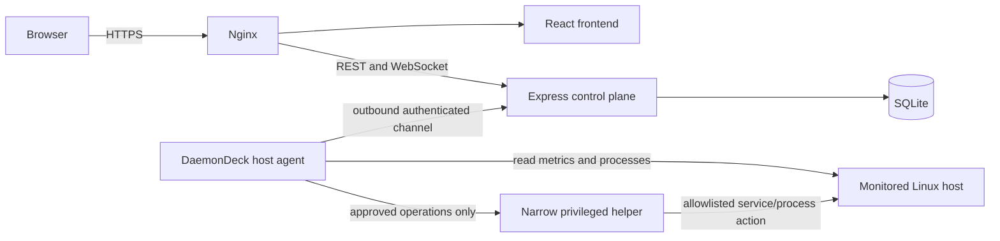

# DaemonDeck v1 Product Definition

Status: Accepted  
Decision date: July 13, 2026  
Product milestone: production-ready single-host v1

## Product Decision

DaemonDeck v1 will be a genuine single-host, systemd-based Linux monitoring and
operations tool.
It will not be presented as only a local demo, and it will not obtain host access by
running the dashboard containers with broad host privileges.

The monitored Linux host will run a small host-native DaemonDeck agent. The React
frontend and Express control plane can remain containerized and unprivileged. The
agent will be the only component that collects host metrics or performs approved
host operations.

The repository already contains package version `1.0.0` and a historical `v1` Git
tag from the prototype stage. This document uses “v1” as a product-readiness
milestone, not as permission to move or replace that tag. Before release, release
engineering must assign the next valid immutable SemVer and identify the historical
tag as a preview in release notes.

This replaces the current implicit assumption that `systeminformation` inside the
backend container can observe the host. In the current implementation it observes
the environment in which the backend process runs. During local development that
may be the developer's machine; in Docker it is normally the backend container.

## Product Goal

Give the operator of one Linux server a trustworthy answer to four questions:

1. Is this host healthy right now?
2. Which resource, process, or managed service is responsible for a problem?
3. Is the data current, and which host produced it?
4. Can an explicitly approved corrective action be performed safely and audited?

DaemonDeck v1 succeeds only when the dashboard reports the monitored host rather
than the dashboard's own container.

## Intended Users

The primary user is a developer, homelab operator, or small-team DevOps/SRE
operator responsible for one systemd-based Linux server.

DaemonDeck v1 assumes:

- one organization and one monitored Linux host;
- a small number of trusted viewer, operator, and administrator accounts;
- installation and agent enrollment by someone with host administrator access;
- TLS termination for every non-loopback deployment, including private networks;
  and
- operations limited to an explicit allowlist.

It is not intended to replace a fleet observability platform, an orchestration
system, or a general remote shell.

## v1 Architecture

### Component Boundaries

#### Frontend

- Displays the enrolled host's identity, connection state, metrics, processes,
  services, alerts, and audit activity.
- Requests operations but never decides whether an operation is authorized.
- Marks data as stale when the control plane has not received a recent agent
  sample.

#### Control Plane

- Owns users, roles, sessions, host enrollment, alert definitions, alert events,
  audit logs, and retained metric samples.
- Authenticates both users and the enrolled agent.
- Authorizes user actions and sends only typed, allowlisted commands to the agent.
- Never treats its own container metrics as monitored-host data.

#### Host Agent

- Runs as a host-native Linux service, not as a privileged dashboard container.
- Collects host identity, CPU, memory, disks, uptime, processes, and managed
  service status.
- Initiates the connection to the control plane so that v1 does not require a
  general inbound agent port.
- Executes only commands represented by the v1 command schema.
- Does not accept arbitrary shell commands.

#### Privileged Helper

- Is optional for read-only installations.
- Exposes only the minimum operations needed for configured service restarts and
  explicitly enabled process termination.
- Uses an allowlist configured on the monitored host.
- Must not grant the agent unrestricted `sudo`, shell, Docker socket, or host
  filesystem access.

## Technical Decisions

The following decisions constrain the v1 implementation:

| Decision | v1 choice | Reason |
| --- | --- | --- |
| Monitored hosts | Exactly one enrolled Linux host | Keeps identity, storage, and UI behavior unambiguous |
| Agent implementation | Node.js and TypeScript in a future `agent/` workspace | Reuses the current language, types, and tooling |
| Agent execution | Host-native service managed by `systemd` | Provides accurate host visibility without privileging dashboard containers |
| Connection direction | Agent initiates an authenticated outbound channel | Avoids exposing a general remote-control listener on the host |
| Sample interval | Five seconds by default, configurable within safe bounds | Matches the current live-dashboard behavior |
| Data freshness | Online, stale, or offline based on the last accepted heartbeat | Prevents old samples from looking current |
| Operations | Typed commands and host-side allowlists only | Prevents DaemonDeck from becoming a remote shell |
| Persistence | SQLite for v1 | Appropriate for one host and a small trusted user base |
| Container access | No host PID namespace, privileged mode, broad host mounts, or Docker socket | Preserves host isolation |

The exact wire encoding may evolve during implementation, but the transport must
be authenticated, encrypted outside loopback development, versioned, and capable
of carrying snapshots, heartbeats, command requests, and command results.

## Functional Scope

### Required Monitoring

- Display the enrolled host's stable ID, hostname, operating system, kernel,
  architecture, agent version, and last-seen time.
- Display CPU total usage, per-core usage, and load averages.
- Display memory, available memory, and swap usage.
- Display mounted disk partitions, capacity, usage, and threshold status.
- Display uptime and running process count.
- List real host processes with PID, name, command, owner, state, CPU, memory, and
  start time.
- Show live updates and a bounded persisted metric history.
- Show an explicit stale or offline state instead of silently retaining the last
  healthy state.

### Required Operations

- Viewer access remains read-only.
- Operators and administrators may request configured service restarts.
- Service identifiers are configured on the agent host and cannot be supplied as
  arbitrary shell text by the browser.
- Process termination remains disabled by default, requires explicit host
  configuration, and must reject the agent and dashboard processes.
- Every requested operation records requester, host, action, target, time, source
  IP, result, and failure reason.
- The UI reports the agent's final result; it must not report success merely
  because the control plane accepted or queued a request.

### Required Alerts

- CPU, memory, and disk alerts use structured metric, comparison, threshold,
  duration, and enabled fields rather than descriptive strings alone.
- The control plane evaluates enabled rules against agent samples.
- Alert state supports pending, firing, and resolved transitions with cooldown or
  deduplication behavior.
- Alert events are persisted and distinguish current health from alert history.
- At least one outbound notification mechanism, initially a generic webhook, is
  available and records delivery success or failure.

### Required Authentication and Safety

- Production startup rejects missing, placeholder, or weak signing secrets.
- Demo accounts are created only in an explicit demo/development mode.
- A first-run administrator can be bootstrapped without a repository-known
  password.
- User sessions and live-stream access expire consistently.
- Agent enrollment produces a revocable agent identity; a reusable enrollment
  secret is not sent with every sample.
- Agent messages and command results are validated against versioned schemas.
- The control plane and agent reject unknown commands and unsupported protocol
  versions.

### Required Operability

- Health and readiness checks distinguish process health, database readiness, and
  agent connectivity.
- The API, WebSocket streams, timers, and database shut down gracefully.
- Database schema upgrades are versioned and preserve existing users, rules, and
  audit logs.
- Installation, enrollment, upgrade, backup, restore, and removal are documented.
- CI runs tests, TypeScript builds, and container builds for every proposed
  change.

## Roles

| Role | v1 permissions |
| --- | --- |
| Viewer | View the enrolled host, metrics, processes, services, alert events, and audit logs |
| Operator | Viewer permissions plus request allowlisted service restarts and explicitly enabled process termination |
| Admin | Operator permissions plus users, roles, agent enrollment/revocation, alert rules, notification settings, and host action policy visibility |

Role enforcement remains server-side. The frontend may hide unavailable actions
for clarity, but hidden controls are not an authorization boundary.

## Explicit Non-Goals

The following are outside v1:

- managing more than one enrolled host;
- Docker container or Kubernetes workload monitoring;
- arbitrary commands, terminals, scripts, package upgrades, reboots, or file
  management;
- the current generic `run-audit`, `clear-cache`, and `maintenance-check` admin
  action names unless a later specification replaces them with narrowly defined,
  typed operations;
- automatic remediation triggered directly by an alert;
- high availability or multiple control-plane replicas;
- long-term, high-cardinality metrics comparable to Prometheus;
- public self-registration, organizations, teams, billing, or multitenancy; and
- support for Windows or macOS agents.

These constraints are deliberate. Multi-server support is a post-v1 extension of
the agent protocol, not a reason to weaken the single-host acceptance criteria.

## Status Vocabulary

Project documentation uses exactly these delivery states:

| Status | Meaning |
| --- | --- |
| Implemented | Works end to end in the current code within the limitation stated in the same row |
| Prototype | Some code or UI exists, but the behavior is simulated, incomplete, or not reliable enough for the v1 promise |
| Planned | Required or desired behavior has no complete end-to-end implementation yet |

`Implemented` does not mean production-hardened. A limitation must be stated when
current behavior operates only in the backend runtime rather than on the enrolled
host targeted by v1.

## v1 Acceptance Criteria

The v1 release is complete only when all of the following are demonstrated on a
supported Linux host:

### Identity and Data Accuracy

- [ ] A freshly installed agent can be enrolled as the one monitored host.
- [ ] The UI shows the same hostname, OS, kernel, CPU count, memory, disks, and
  representative processes as direct commands on that host.
- [ ] Restarting only the dashboard containers does not change the monitored-host
  identity.
- [ ] Disconnecting the agent causes the UI to become stale and then offline
  within documented time limits.
- [ ] Reconnecting the same agent restores the same host identity without creating
  a duplicate host.

### Authorization and Operations

- [ ] A viewer cannot invoke any host operation through either the UI or direct
  API calls.
- [ ] An operator can restart an allowlisted test service and receives its actual
  result.
- [ ] A non-allowlisted service and an unknown command are rejected by both the
  control plane and agent.
- [ ] Process termination is unavailable by default and works only after explicit
  host-side enablement.
- [ ] Successful, failed, rejected, and timed-out operations are all audited with
  host and actor identity.

### Alerts

- [ ] A controlled threshold breach moves a rule through pending and firing.
- [ ] Recovery moves the alert to resolved without duplicate notification spam.
- [ ] Webhook delivery success and failure are observable and audited.
- [ ] Disabled rules do not create new alert events.

### Security and Lifecycle

- [ ] Production startup rejects explicit demo mode and placeholder signing
  secrets, and a fresh production database contains no demo accounts.
- [ ] Revoking the agent credential prevents new samples and commands.
- [ ] User logout or session expiry ends REST and live-stream authorization.
- [ ] A database backup can be restored into a clean installation.
- [ ] An upgrade from the previous documented schema preserves persistent data.

### Automated Verification

- [ ] Backend unit and integration tests pass.
- [ ] Agent unit and protocol tests pass.
- [ ] Frontend component and role-behavior tests pass.
- [ ] A browser end-to-end test covers login, live host data, an allowlisted
  operation, its audit record, and logout.
- [ ] Dashboard container builds and an agent installation smoke test pass in CI.

## Delivery Boundary

This document defines the destination; it does not claim that the agent or the v1
operations path already exists. Until the agent is implemented and the acceptance
criteria pass:

- local backend execution reports the backend machine/runtime;
- Docker backend execution normally reports the backend container;
- managed service restarts and admin system actions remain demonstrations; and
- DaemonDeck releases should be labelled development or preview releases rather
  than production-ready v1.
